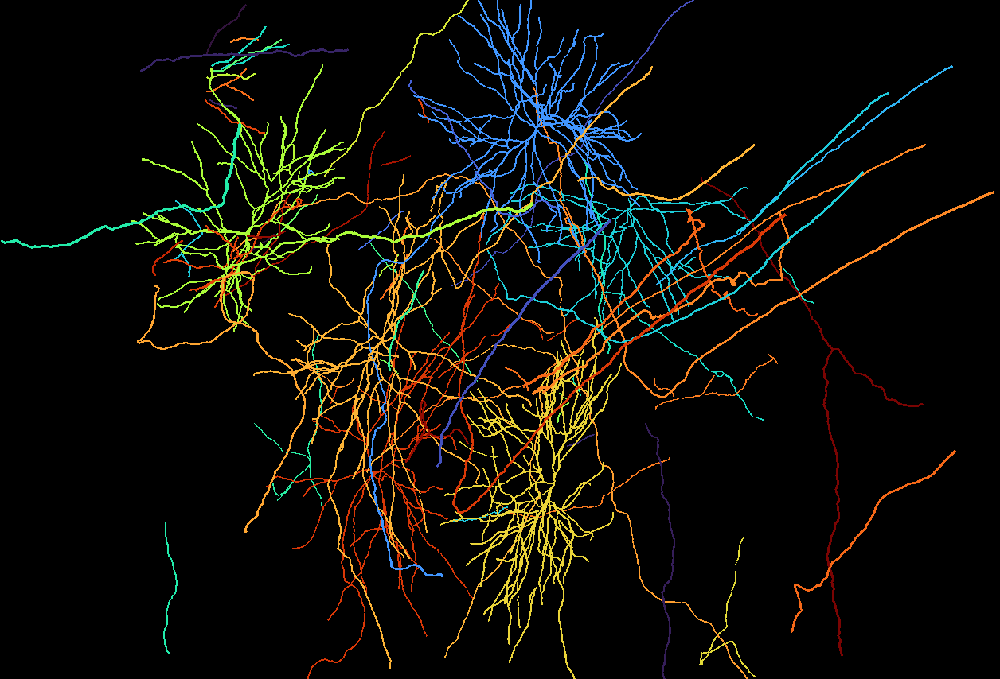
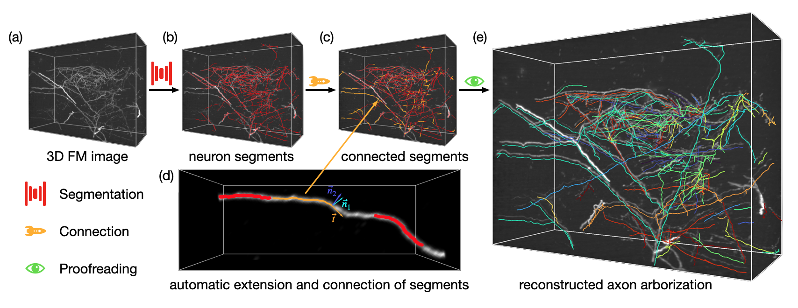
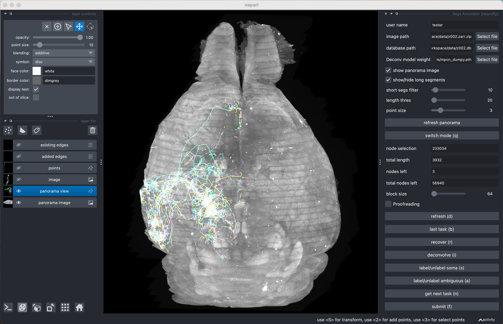

# NeuroFly: A framework for single neuron reconstruction at whole-brain scale


## Installation 

pip install --upgrade git+https://github.com/beanli161514/neurofly.git

## Dataset

We provide several expert-proofread reconstruction results for testing, model training, and evaluation. [Zenodo Link](https://zenodo.org/records/13328867)


### Content of samples
| name           | size  | species | label type  | imaging |
|----------------|-------|---------|-------------|---------|
| rm009_labeled  | 629MB | macaque | skeleton    | VISoR   |
| mouse_labeled  | 260MB | mouse   | skeleton    | VISoR   |
| z002_labeled   | 204MB | mouse   | skeleton    | VISoR   |
| fmost_labeled  | 370MB | mouse   | skeleton    | fMOST   |
| RM009_noisy_1  | 65MB  | macaque | morphology  | VISoR   |
| RM009_noisy_2  | 65MB  | macaque | morphology  | VISoR   |
| fmost_test     | 65MB  | mouse   | morphology  | fMOST   |
| z002_dendrites | 768MB | mouse   | morphology  | VISoR   |
| RM009_arbor_1  | 288MB | macaque | morphology  | VISoR   |
| RM009_axons_1  | 600MB | macaque | morphology  | VISoR   |
| RM009_axons_2  | 600MB | macaque | morphology  | VISoR   |
| z002           | 8.92G | mouse   | morphology* | VISoR   |

$*$ annotation in progress
### Label format
Morphology labels are graphs saved in SQLite database with 3 tables:
|    segments    |  nodes  |  edges  |
|:--------------:|:-------:|:-------:|
|       sid      |   nid   |   src   |
|     points     |  coord  |   des   |
| sampled_points | creator |   date  |
|                |  status | creator |
|                |   type  |         |
|                |   date  |         |
|                | checked |         |

Segments are results of the segmentation stage, they are used to generate initial nodes and edges.


## Minimal Usage Example




### Segmentation

NeuroFly support whole brain image saved in hierarchical data structures(ims, h5, and zarr) and small image volumes saved in single-channel tiff format. Here we use a mouse brain in our dataset named z002.ims as example.

First, extract some segments using command line interface 'seg'. For VISoR and fMOST images, you can just use the default conassets
```
seg -i z002.ims -vis -d z002.db
```
Then you should see the extracted segments and a z002.db file in your working dictionary.


### Manual Proofreading
Then skip the connection stage (algorithm is in development) and manually proofread the result. 

Launch segs_annotator using command line interface 'segs_annotator' or from napari menu, Plugin -> neurofly -> Segs Annotator

#### Load data
Load image file (z002.ims) and database file (z002.db), then click 'refresh panorama' button to show the panorama view.



In panorama mode, you can easily identify sparse, bright signals that are promising for reconstruction.
